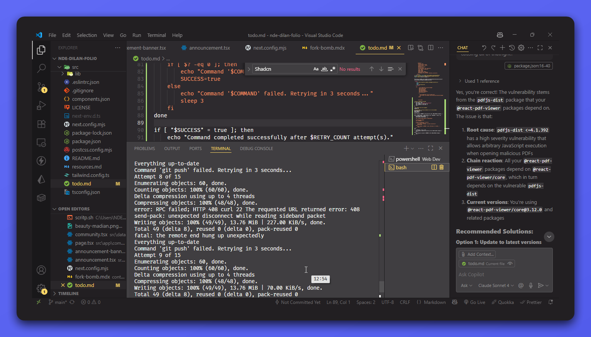

# Retry Command Script

A simple Bash script that automatically retries failed commands a specified number of times before giving up. This utility helps when dealing with commands that may fail intermittently due to network issues, rate limits, or other temporary problems.




## Features

- Automatically retries commands when they fail
- Configurable retry count (defaults to 5 attempts)
- Clear feedback during execution
- Proper exit codes (0 on success, 1 on failure)

## Installation

After cloning this repository, follow these steps to make the script available globally:

### On Unix-based systems (Linux, macOS)

```bash
# Make the script executable
chmod +x retry-command.sh

# Move to a directory in your PATH
sudo cp retry-command.sh /usr/local/bin/retry-command
```

### On Windows with Git Bash

```bash
# Create a personal bin directory if it doesn't exist
mkdir -p ~/bin

# Copy the script and make it executable
cp retry-command.sh ~/bin/retry-command
chmod +x ~/bin/retry-command

# Add to PATH in your .bashrc
echo 'export PATH="$HOME/bin:$PATH"' >> ~/.bashrc
source ~/.bashrc
```

## Usage

```bash
# Basic usage
retry-command "your-command-here"

# With custom retry count
retry-command "your-command-here" 10

# Examples
retry-command "git push" 5
retry-command "npm test" 3
retry-command "curl -f https://api.example.com/health"
retry-command "docker build -t myapp ."
```

## How It Works

The script will:
1. Run your command
2. If it fails, wait 3 seconds and try again
3. Continue until success or max retries is reached
4. Report the final outcome

## Contributing

Contributions are welcome! If you find this script helpful, please consider starring the repository.